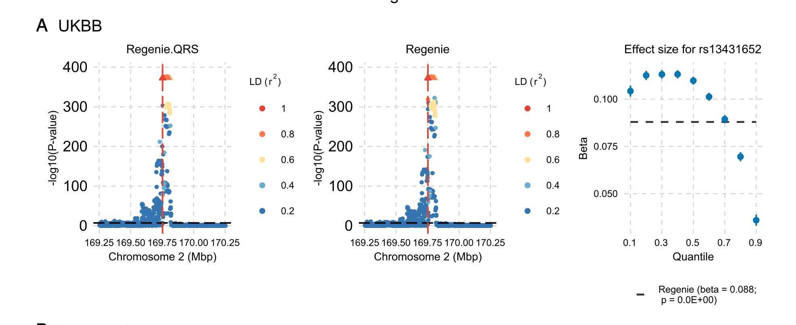

*Figure 1. Quantile-regression GWAS example at the **G6PC2** locus in UKBB. The two locus-zoom panels compare Regenie.QRS and mean-based Regenie results, while the rightmost panel shows how the estimated effect size for **rs13431652** varies across quantiles. The effect is stronger at lower and intermediate quantiles and weaker in the upper tail, illustrating heterogeneous genetic effects that a mean-based analysis summarizes as a single average effect.*

## Ph.D. Position

We invite applications for a fully funded PhD position in statistics with a project on **Quantile Regression Models for Genetic Discovery and Phenotype Prediction**. The goal is to develop scalable statistical and computational tools for modern genome-wide association studies (GWAS) and polygenic risk score (PRS) prediction. The overall aim is to move beyond standard mean-based models and develop quantile-regression methods that can detect heterogeneous genetic effects and predict the full conditional distribution of complex phenotypes.

The position is at **Lund University**, Sweden, in the **Department of Statistics** at Lund University School of Economics and Management.

The local supervisor and coordinator is [Jonas Wallin](https://jonaswallin.github.io/). The project is carried out in collaboration with [Iuliana Ionita-Laza](https://www.columbia.edu/~ii2135/) at Columbia University, who will serve as external co-supervisor.

## Project Description

Genome-wide association studies and polygenic risk score models are central tools in statistical genetics, but most standard approaches are based on linear models for the phenotypic mean. Such models are powerful and interpretable, but they can miss genetic effects that vary across the phenotype distribution. As illustrated in **Figure 1**, and in particular in **the rightmost panel**, the effect of a variant can differ substantially across quantiles of the trait distribution. In that panel, the estimated effect size for **rs13431652** is stronger at lower and intermediate quantiles and weaker in the upper tail, showing how quantile regression can reveal heterogeneity that mean-based models may obscure.

Quantile regression offers a principled way to study these heterogeneous genetic effects. Instead of modeling only the mean of a trait, quantile regression models how genetic variants influence different parts of the conditional phenotype distribution. This is useful both for genetic discovery and for phenotype prediction, where one may want prediction intervals or tail-probability risk summaries rather than only a point prediction.

Recent work on **Regenie.QRS** shows that whole-genome quantile regression can be made computationally efficient at biobank scale, while accounting for genetic structure and related individuals. In applications to the UK Biobank and ProgeNIA/SardiNIA, quantile-regression methods have been used to identify and characterize heterogeneous genetic effects that are not visible from a conventional mean-based analysis alone [1].

In this project, we are interested in both theoretical and practical questions. The theoretical questions include how to construct valid and powerful quantile-regression tests and prediction methods in high-dimensional genetic data, how to handle population structure and relatedness, and how to quantify uncertainty in the tails of the phenotype distribution. The practical questions include how to make these methods scalable to modern biobank data and how to implement them in user-friendly software.

The doctoral student is expected to contribute to one or more of the following themes:

* developing scalable quantile-regression methods for biobank-scale GWAS with population structure and/or related individuals;
* constructing quantile-regression-based PRS methods that provide prediction intervals and tail-probability risk summaries;
* developing computational strategies such as screening rules, ADMM-based optimization, mixed-model approximations, and conformalized prediction intervals;
* implementing user-friendly software, preferably as open-source tools in R and/or Python.

The project builds on recent work on whole-genome quantile regression at biobank scale [1], feature-splitting algorithms for ultra-high-dimensional quantile regression [2], and integrated quantile rank testing for gene-level associations [3].

The supervisory team combines local expertise in statistics, computational methods, and high-dimensional modeling at Lund University with external expertise in statistical genetics and high-dimensional omics at Columbia University.

#### The candidate

We are looking for a student that fits the following criteria:

* MSc in statistics, mathematics, computer science, biostatistics, bioinformatics, data science, or another relevant quantitative field;
* strong interest in statistical genetics, high-dimensional statistics, optimization, or machine learning;
* programming experience in R, Python, C++, or a similar language;
* experience with genomics, large-scale data analysis, numerical optimization, or open-source software development is meriting;
* excellent written and oral communication skills in English.

## Application

The formal application should include a personal letter, a curriculum vitae, certified copies of grades and degree certificates, copies of relevant written work such as a Bachelor's or Master's thesis and articles that you have authored or co-authored, and contact information for one reference familiar with your qualifications.

The official application link will be added here: **[APPLICATION LINK]**.

For further information, please contact:

[Jonas Wallin](https://jonaswallin.github.io/)
Local supervisor and coordinator
Associate Professor, Department of Statistics, Lund University
[jonas.wallin@stat.lu.se](mailto:jonas.wallin@stat.lu.se)

[Iuliana Ionita-Laza](https://www.columbia.edu/~ii2135/)
External supervisor
Professor of Biostatistics, Department of Biostatistics, Columbia University
[ii2135@cumc.columbia.edu](mailto:ii2135@cumc.columbia.edu)
Columbia profile: [https://www.publichealth.columbia.edu/profile/iuliana-ionita-laza-phd](https://www.publichealth.columbia.edu/profile/iuliana-ionita-laza-phd)
Research group: [https://www.publichealth.columbia.edu/research/programs/precision-prevention/research/statistics-genetics-iuliana-ionita-laza](https://www.publichealth.columbia.edu/research/programs/precision-prevention/research/statistics-genetics-iuliana-ionita-laza)

## References

1. Fan Wang, Chen Wang, Tianying Wang, Marco Masala, Edoardo Fiorillo, Marcella Devoto, Francesco Cucca, and Iuliana Ionita-Laza. *Computationally efficient whole-genome quantile regression at biobank scale*. **Proceedings of the National Academy of Sciences**, 122(50):e2513007122, 2025. [https://doi.org/10.1073/pnas.2513007122](https://doi.org/10.1073/pnas.2513007122)
2. Hanqing Wu, Jonas Wallin, and Iuliana Ionita-Laza. *Scalable Ultra-High-Dimensional Quantile Regression with Genomic Applications*. arXiv:2601.02826, 2026. [https://arxiv.org/abs/2601.02826](https://arxiv.org/abs/2601.02826)
3. Tianying Wang, Iuliana Ionita-Laza, and Ying Wei. *Integrated Quantile Rank Test (iQRAT) for Gene-Level Associations*. **The Annals of Applied Statistics**, 16(3):1423-1444, 2022. [https://doi.org/10.1214/21-AOAS1548](https://doi.org/10.1214/21-AOAS1548)
